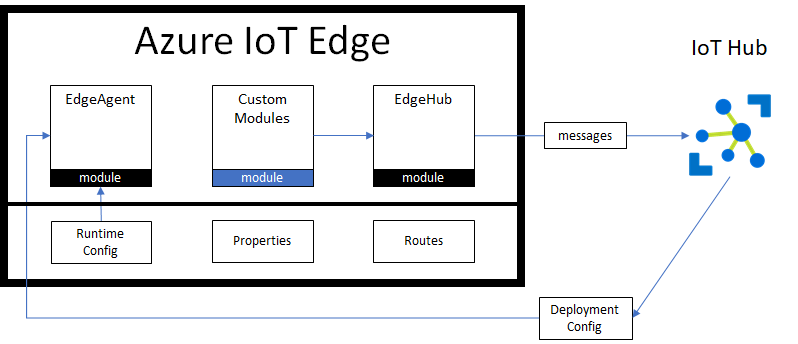
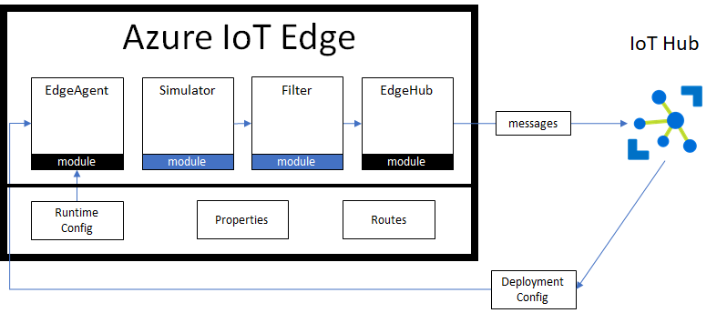

Welcome to the Azure IoT Edge Dev Tool Introduction Course

The **Azure IoT Edge** addresses two main scenarios:
1. **Field Gateway:** Enables non internet connected devices to send their data to Azure.
1. **Intelligence:** Enables local storage, compute and real-time decision making on the edge of your network.

The **Azure IoT Edge Dev Tool** assists developers in creating IoT Edge Solutions, coding and deploying modules and creating CI/CD pipelines. This CLI tool complements the [IoT Edge VS Code extension](https://marketplace.visualstudio.com/items?itemName=vsciot-vscode.azure-iot-edge) by turning multi-step manual processes into simple one-line commands, such as `iotedgedev modules --build --deploy`, which performs all of the following for each module: dotnet restore, build, publish, docker build, tag, push. And then deploys the configuration to the IoT Edge device.

If you are new to Azure IoT Edge, then you should read through the [Azure IoT Edge Concepts](https://docs.microsoft.com/en-us/azure/iot-edge/iot-edge-modules). In a nutshell, the Azure IoT Edge runtime is based on containers. The runtime itself is a container called EdgeAgent. Microsoft also provides a container called EdgeHub that sends messages from the IoT Edge device to your IoT Hub. You, the developer, create custom modules, package them into containers and deploy them to the IoT Edge device via the IoT Hub. One of the biggest benefits of using the IoT Edge Runtime, is that you can remotely deploy new modules, adjust properties, and even call methods on the IoT Edge Device.

In this tutorial, we are going to introduce you to the Azure IoT Edge Dev Tool so you can see how the tool works without having to install anything on your computer.  The solution we are going to build consists of a **simulated temperature sensor** module that will generate random data and a **filter** module which filters messages before sending them to IoT Hub.

